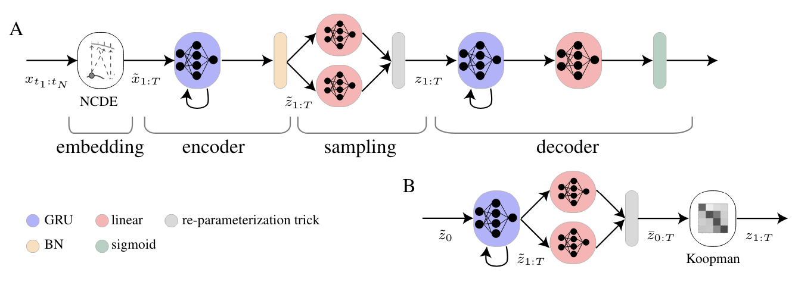

# KoVAE
[Koopman VAE (KoVAE)](https://openreview.net/pdf?id=eY7sLb0dVF), a new generative framework that is based on a novel design for the model prior.

<div align=center></div>

## :snake: Environment
Install the environment from the yaml file given here: environment.yml
```bash
conda env create -f environment.yml
```

## Data
Stocks and Energy data are located in /datasets. Sine is generated.
utils_data.py contains functions to load the data both in regular and irregular setups. Specifically, the irregular data is pre-processed by the TimeDataset_irregular class,
and it might take a while. Once the data pre-processing is done, it is saved in the /datasets folder.


## :rocket: Training

You can find a training code on the sine and stock datasets in the repository. You may also run other datasets by adding them and adjusting the dataloader.
To run the training process, run the script of sine_regular.sh or stock_regular.sh.
Or simply:
```bash
python3 run_regular.py --dataset <data_name> --w_kl <a> --w_pred <b>
```

You can also run the irregular setup with a similar command, adding a missing rate of 0.3,0.5,0.7:
```bash
python3 run_irregular.py --dataset <data_name> --w_kl <a> --w_pred <b> --missing_value 0.<x> --inp_dim <num_of_channels_in_dataset>
```

## :page_facing_up: Paper
```bibtex
@inproceedings{
naiman2024generative,
title={Generative Modeling of Regular and Irregular Time Series Data via Koopman {VAE}s},
author={Ilan Naiman and N. Benjamin Erichson and Pu Ren and Michael W. Mahoney and Omri Azencot},
booktitle={The Twelfth International Conference on Learning Representations},
year={2024},
url={https://openreview.net/forum?id=eY7sLb0dVF}
}
```
